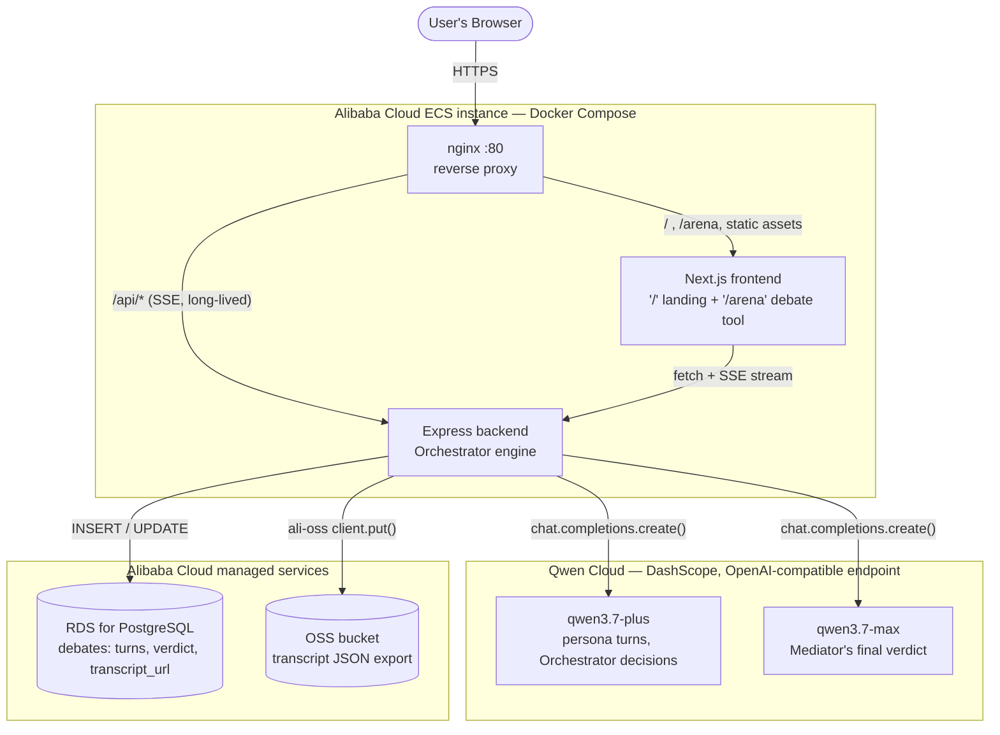

# Adversary

Stress-test a startup pitch against a real multi-agent society of adversarial
AI personas — not a single chatbot giving one opinion, not a fixed script of
canned rounds, but an **Orchestrator agent that decides live, turn by turn,
who speaks next, when to summon a specialist witness, and when the
cross-examination is actually finished.**

Built for the **Qwen Cloud / Alibaba Cloud Global AI Hackathon Series — Track:
Agent Society**.

## Features

- **Core panel (always active):** VC (market size, defensibility, moat),
  Engineer (assumes it's harder to build than you think), Customer (only
  cares whether this beats their current alternative). All three open
  independently, in parallel, the moment a pitch is submitted.
- **A real Orchestrator agent, not a hardcoded round count.** After the
  opening statements, an LLM call reads the live transcript and decides one
  of three actions — `speak` (route specific personas to rebut a specific
  point), `summon` (pull in a new specialist), or `conclude` — repeating
  until it decides the cross-examination is done or a safety cap is hit.
  Nothing about debate length or shape is scripted; it's decided live, per
  pitch.
- **Dynamic specialist summoning.** The Orchestrator can call in any of 18
  domain specialists (healthcare, fintech, consumer/social, deep tech,
  enterprise SaaS, legal/regulated, climate/energy) on its own judgment,
  grounded in something specific already said in the debate — not a
  pre-computed suggestion list. A healthcare pitch has summoned four
  specialists in one debate (HIPAA officer, clinician, competitor, payer
  analyst) when the transcript actually warranted it. You can also force a
  witness in manually — search the full roster or draft a fully custom
  persona from a name + description.
- **Real tool use.** Personas have access to a `calculate` tool (a hand-rolled
  safe arithmetic evaluator — no `eval`) and a `search_pitch` tool, called via
  Qwen's native function-calling API when a persona wants to verify a number
  or quote the pitch exactly instead of paraphrasing from memory. Tool calls
  are shown in the UI, not hidden.
- **Shared memory, not per-call state.** Every agent call reads from and
  writes to one `DebateMemory` object (`backend/src/debateMemory.ts`) — the
  pitch, the active panel, and the ordered transcript. No model call carries
  memory of its own between turns; continuity comes entirely from what the
  orchestrator explicitly puts in front of each call.
- **Mediator verdict:** a flagship-model call synthesizes the full transcript
  into a fundability score (1–10), the strongest point in the pitch's favor,
  the weakest point, the single biggest risk, and one concrete next step.
- **Real-time streaming:** Server-Sent Events, so the frontend shows agents
  "speaking" one at a time, with named loading states for whoever's turn is
  in flight — including the Orchestrator's own reasoning, rendered live.
- **Every debate is persisted:** a record in Postgres (Alibaba Cloud RDS) and
  the full transcript exported as JSON to Alibaba Cloud OSS.

## Agent architecture

```
Pitch submitted
      │
      ▼
Core panel opens (VC, Engineer, Customer) — parallel, deterministic genesis
      │
      ▼
┌─────────────────────────────────────────────────────────┐
│  loop (until "conclude" or turn cap):                    │
│                                                            │
│   Orchestrator reads DebateMemory → decides:               │
│     • speak(personaIds, directives)  → those personas turn │
│     • summon(specialistId)           → new persona opens   │
│     • conclude                       → exit loop           │
│                                                            │
│   Each persona turn may call calculate / search_pitch      │
│   tools before producing its final 3-4 sentence turn       │
└─────────────────────────────────────────────────────────┘
      │
      ▼
Mediator (flagship model) reasons over the full transcript → verdict
      │
      ▼
Persisted to RDS + OSS, streamed to the client the whole way via SSE
```

This is the actual control flow in `backend/src/debateService.ts` — the
Orchestrator (`callOrchestrator` in `backend/src/qwen.ts`) is a real decision-
maker, not a UI label. See [`backend/src/debateMemory.ts`](backend/src/debateMemory.ts)
for the shared-memory object and [`backend/src/agentTools.ts`](backend/src/agentTools.ts)
for the tool implementations.

## Architecture



The frontend has two real routes: `/` is the landing page, `/arena` is the
debate tool itself — both are actual Next.js pages (not a client-side view
toggle), so refresh, back/forward, and direct links all behave correctly.

In production, nginx fronts both containers on port 80: `/api/*` proxies to
the backend (with SSE-safe buffering/timeout settings — a single debate can
involve half a dozen or more sequential Qwen calls and run several minutes),
everything else proxies to the Next.js frontend. See
[`nginx/nginx.conf`](nginx/nginx.conf).

**Alibaba Cloud deployment proof:** [`backend/src/oss.ts`](backend/src/oss.ts)
is a clean, non-stubbed use of the `ali-oss` SDK — every completed debate is
uploaded there as JSON. RDS wiring lives in
[`backend/src/db.ts`](backend/src/db.ts) and
[`backend/src/pgStore.ts`](backend/src/pgStore.ts).

### Tech stack

| Layer | Tech |
|---|---|
| Frontend | Next.js (App Router) + TypeScript + Tailwind CSS |
| Backend | Node.js + Express + TypeScript |
| LLM | Qwen Cloud, OpenAI-compatible endpoint (`qwen3.7-plus` for personas, the Orchestrator, and the domain classifier logic; `qwen3.7-max` for the Mediator's final verdict — both env-overridable) |
| Agentic control flow | Hand-rolled Orchestrator loop + native Qwen tool-calling — no LangChain/CrewAI/AutoGen dependency |
| Database | Alibaba Cloud RDS for PostgreSQL |
| Object storage | Alibaba Cloud OSS (`ali-oss` SDK) |
| Realtime | Server-Sent Events |
| Deployment | Docker Compose + nginx on Alibaba Cloud ECS |

## Local setup

### Option A — without Docker

Requires Node.js 20+.

```bash
# 1. Backend
cd backend
cp .env.example .env      # fill in QWEN_API_KEY at minimum
npm install
npm run dev                # http://localhost:4000

# 2. Frontend (separate terminal)
cd frontend
cp .env.example .env.local # NEXT_PUBLIC_API_BASE_URL=http://localhost:4000
npm install
npm run dev                # http://localhost:3000 (landing) / /arena (the tool)
```

Without `RDS_HOST` set, the backend falls back to an in-memory debate store
(debates don't survive a restart). Without OSS credentials set, transcripts
are written to `backend/data/transcripts/` instead. Both fallbacks are
automatic — nothing else to configure for local development.

To run the frontend against a scripted mock instead of a live backend (no
API key needed, useful offline), set `NEXT_PUBLIC_USE_MOCK=true` in
`frontend/.env.local`. The mock simulates the same Orchestrator-driven event
sequence (openings → summon → rebuttals → verdict) with canned content.

### Option B — with Docker Compose

```bash
cp .env.example .env   # fill in QWEN_API_KEY at minimum
docker compose up --build
```

Serves the whole app on **http://localhost** (nginx on port 80, proxying to
both containers).

### Applying the RDS schema

Once `RDS_HOST` (and the other `RDS_*` vars) are set in `backend/.env` (or
the root `.env` for Docker):

```bash
cd backend
npm run migrate         # or: npm run build && npm run migrate:built
```

This applies [`backend/src/schema.sql`](backend/src/schema.sql) (idempotent —
safe to re-run). The `debates` table stores the whole debate as a single
`turns` JSONB array (one row per turn: persona, content, kind, who it's
responding to, any tool calls) plus `active_persona_ids`, rather than fixed
round columns — matching the dynamic, variable-length nature of the debate
itself.

## Deploying to Alibaba Cloud ECS

Assumes an ECS instance with Docker + the Compose plugin already installed,
and this repo cloned onto it.

```bash
# On the ECS instance, inside the cloned repo:
cp .env.example .env
# fill in QWEN_API_KEY, RDS_*, and OSS_* credentials
./deploy.sh
```

`deploy.sh` pulls the latest commit, rebuilds the three containers (backend,
frontend, nginx), and brings them up with `docker compose up -d`. Re-run it
for subsequent deploys.

Point your domain (or the instance's public IP) at the ECS instance — the
app is served on port 80.

## Repo layout

```
backend/     Express API — Orchestrator engine, Qwen Cloud + RDS + OSS integration
  src/debateService.ts   the Orchestrator-driven debate loop
  src/debateMemory.ts    the shared-memory object every agent call reads/writes
  src/qwen.ts            Qwen Cloud calls: persona turns, Orchestrator, Mediator
  src/agentTools.ts      calculate / search_pitch tool implementations
  src/personas.ts        core panel + 18-role specialist library + system prompts
frontend/    Next.js app (App Router) — "/" landing, "/arena" the debate tool
nginx/       Reverse proxy config used by docker-compose
docs/        Drop the architecture diagram export here
deploy.sh    ECS deployment script
docker-compose.yml
```

## License

MIT — see [LICENSE](LICENSE).
